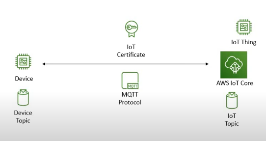
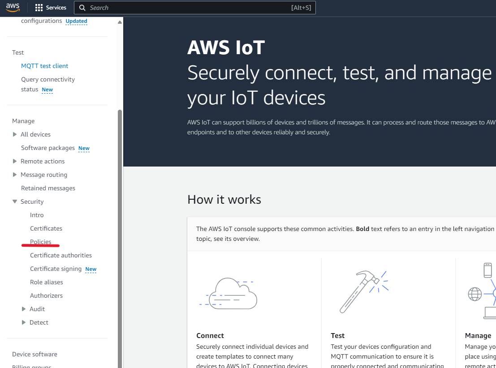
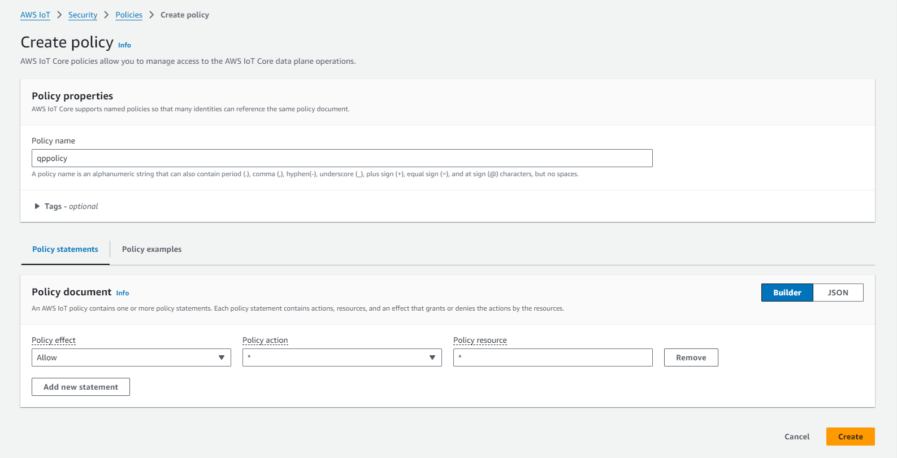
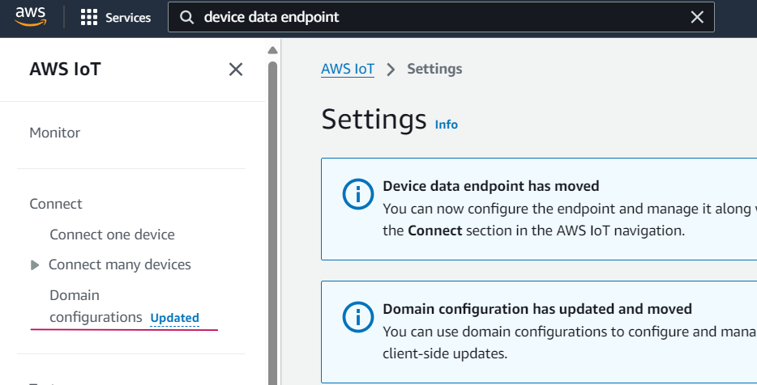
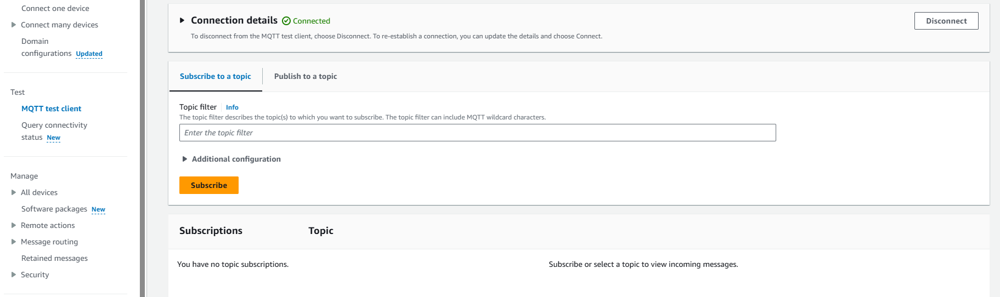
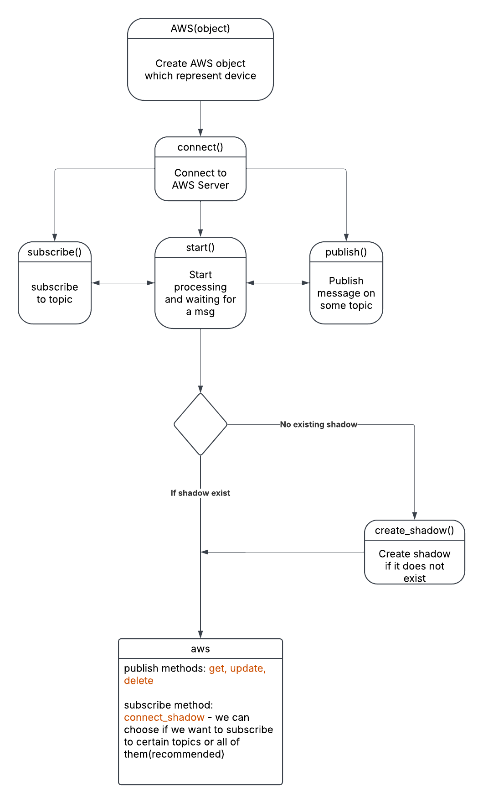
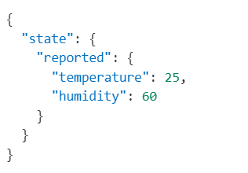
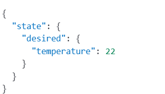

# AWS IoT to Device Communication

First, we need to register our device (which can be a sensor, actuator, or mobile phone) as a **Thing**, which is a virtual representation of our device.

Once we do that, an **IoT certificate** is generated, which is used by the device for authentication.  

Then, we use our solution to communicate with the **AWS IoT Core** service.

---

## Register the Device

1. **Registering the device as a Thing**  
   - Log in to your AWS Account and select a region in the upper right corner.
   - Create an **IoT policy** that authorizes the device to perform actions within AWS IoT Core.  
     - Navigate to **Security → Policies** in the AWS console.
     - The device has a certificate associated with the created policy.
     - Depending on the policy, certain actions can be allowed or restricted.
     - In this guide, we create a **non-restriction policy**, allowing all actions for all resources. However, in practice, devices may need restrictions on specific operations and topics.

2. **Creating a Thing and obtaining certificates**  
   - After creating the policy, register your device as a **Thing** and attach the policy:  
     - Navigate to **Manage → Things → Create things → Create single thing**.
     - Enter the **Thing name**, check **No Shadow**, and select **Auto-generate a new certificate**.  
       (This generates certificate files used for authentication. AWS IoT supports **X.509 client certificates**.)
   - Click **Create thing**.

3. **Checking the device data endpoint**  
   - Devices connect to **AWS IoT Core** and other services via **device endpoints** unique to your AWS account.
   - Each account has multiple endpoints supporting different IoT functions.
   - To find your endpoint:  
     - Navigate to **Connect → Domain configurations** and copy the **Domain name** from the domain configurations table.

---

## MQTT Client

- **MQTT Test Client**  
  The MQTT test client is used to monitor MQTT messages exchanged within your AWS account.  
  - Devices publish messages to specific topics to communicate their state with AWS IoT.
  - AWS IoT also publishes MQTT messages to inform devices and apps about changes and events.
  - Using the MQTT test client, you can **subscribe** to message topics and **publish** messages to verify communication.
  
 

---

## Solution Design

 

## Usage

1. **Creating an AWS object**  
   - After registering a **THING**, the first step to using the AWS library is to create an **AWS object**.  
     - This initializes the MQTT client, links it to the **Shadow Manager**, and assigns a **Client ID**.

2. **Connecting to AWS IoT Core**  
   - The `connect` method within the AWS class establishes a connection to the AWS IoT Core server.
   - The connection **uses the MQTT protocol**, which operates over **TCP**, while **IP** is used at the network level.

3. **Disconnecting**  
   - The `disconnect` method disconnects the device from AWS IoT Core.
   - When we create an AWS object, we are essentially **creating our device within the program**.

4. **Basic MQTT methods**  
   - **Subscribe:** Used to subscribe to a specific topic to receive messages.
   - **Publish:** Used to send data to a topic so that subscribed clients can receive it.
   - **Callback functions:**  
     - The user can define a custom **callback method** that gets triggered when a message arrives on a specific topic.
     - The `set_callback` method allows multiple callback functions to be added to a list.
     - When a message arrives, the appropriate callback function is executed.

---

## Shadows

### What is AWS IoT Device Shadow?

AWS IoT Device Shadow is a service that provides **persistent state management** for IoT devices.  
It allows cloud applications to interact with devices **even when they are offline** by maintaining a **virtual representation** (shadow) of the device's state, stored as a JSON document in AWS IoT Core.
Each device can have multiple named shadows, as well as a default (unnamed) shadow.

The shadow document consists of:

- **Desired state:** Set by cloud applications to request changes in the device state.
- **Reported state:** Updated by the device to reflect its actual status.
- **Delta state:** Automatically generated by AWS, representing the difference between **desired** and **reported** states.

Using MQTT, devices can interact with their shadows by publishing and subscribing to specific shadow topics.

### How AWS IoT Shadows Work with MQTT
Our existing Python implementation interacts with AWS IoT Core via MQTT, which is the primary mechanism for shadow operations. AWS reserves the following MQTT topics for shadow communication:

- **Shadow Update:**  
  Creates a shadow if it doesn't exist, or updates the contents of an existing shadow with the state information provided in the message body. AWS IoT records a timestamp with each update to indicate when the state was last updated. 
  When the shadow's state changes, AWS IoT sends /delta messages to all MQTT subscribers with the difference between the desired and the reported states. Devices or apps that receive a /delta message can perform actions based on the difference. 
  For example, a device can update its state to the desired state, or an app can update its UI to reflect the device's state change.
  
  - **Publish to:**
    - `$aws/things/{client_id}/shadow/update`
    - `$aws/things/{client_id}/shadow/name/{shadow_name}/update` (for named shadows)
  - **Subscribe to (for response handling):**
    - `$aws/things/{client_id}/shadow/update/accepted`
    - `$aws/things/{client_id}/shadow/update/rejected`
    - `$aws/things/{client_id}/shadow/update/delta`

Example JSON payload for updating a shadow (device reporting its state):

Example JSON payload for requesting a device state change (cloud application):

- **Shadow Retrieval (GET):**  
  Retrieves the current shadow document, including metadata.  
  - **Publish to:**
    - `$aws/things/{client_id}/shadow/get`
    - `$aws/things/{client_id}/shadow/name/{shadow_name}/get`
  - **Subscribe to:**
    - `$aws/things/{client_id}/shadow/get/accepted`
    - `$aws/things/{client_id}/shadow/get/rejected`

- **Shadow Deletion:**  
  Deletes the shadow document and its contents. 
  You can't restore a deleted device shadow document, but you can create a new device shadow with the name of a deleted device shadow document. If you create a device shadow document that has the same name as one that was deleted within the past 48 hours, the version number of the new device shadow document will follow that of the deleted one. If a device shadow document has been deleted for more than 48 hours, the version number of a new device shadow document with the same name will be 0.  
  - **Publish to:**
    - `$aws/things/{client_id}/shadow/delete`
    - `$aws/things/{client_id}/shadow/name/{shadow_name}/delete`
  - **Subscribe to:**
    - `$aws/things/{client_id}/shadow/delete/accepted`
    - `$aws/things/{client_id}/shadow/delete/rejected`

**Important:**  
Before using **GET, UPDATE, or DELETE**, subscribe to the appropriate topics to receive responses.

---

## Shadow Management

### Creating a Shadow

Two options:
- **Using the AWS Console**
- **Creating a shadow programmatically**  
  - The `create_shadow` method first checks if an unnamed shadow already exists.
  - If it doesn’t exist, it **publishes a request** to the **update topic** and creates a new **unnamed shadow**.
  - If no state is specified, a **default state** is sent.

### Subscribing to Topics

- **For updating a shadow**, subscribe to:
  - `update/accepted` – confirms a successful update
  - `update/rejected` – indicates an update failure
  - `update/delta` – tracks changes in shadow state
  - *(Optional)* `update/documents` – history of shadow changes

- **For retrieving a shadow**, subscribe to:
  - `get/accepted` – confirms a successful retrieval
  - `get/rejected` – indicates retrieval failure

- **For deleting a shadow**, subscribe to:
  - `delete/accepted` – confirms successful deletion
  - `delete/rejected` – indicates deletion failure

### `connect_shadow` Function

- The `connect_shadow` function is **essential**.  
  - If **no specific topics** are provided, it **automatically subscribes** to all relevant topics.
  - You can also explicitly define **which topics to subscribe to**.

### Core Methods for Shadow Management

Three main methods for working with shadows:
- **`update_shadow`** – Updates the shadow
- **`get_shadow`** – Retrieves the current shadow state
- **`delete_shadow`** – Deletes the shadow

Under the hood, these methods function as **publish methods**, meaning they send MQTT messages to appropriate **shadow topics**.

